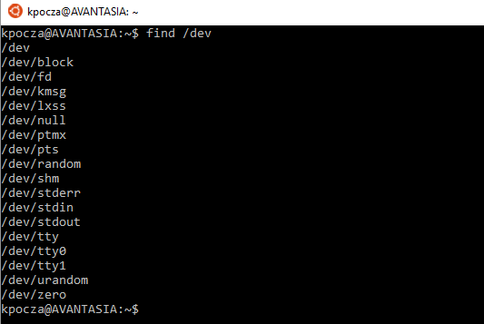
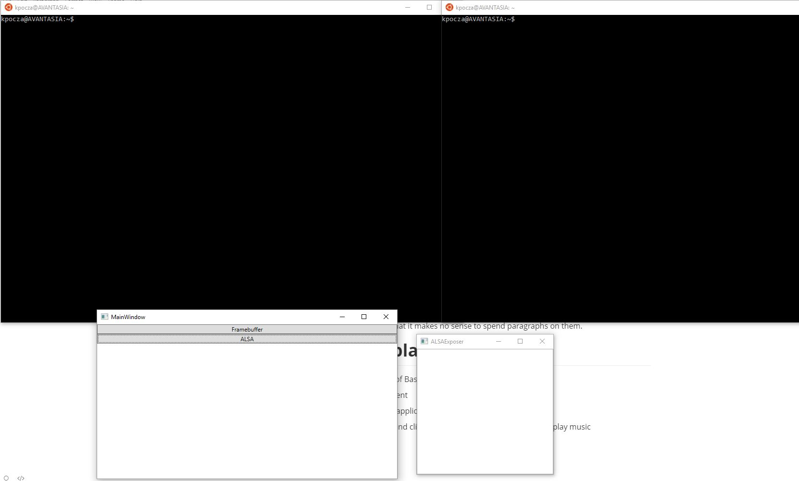
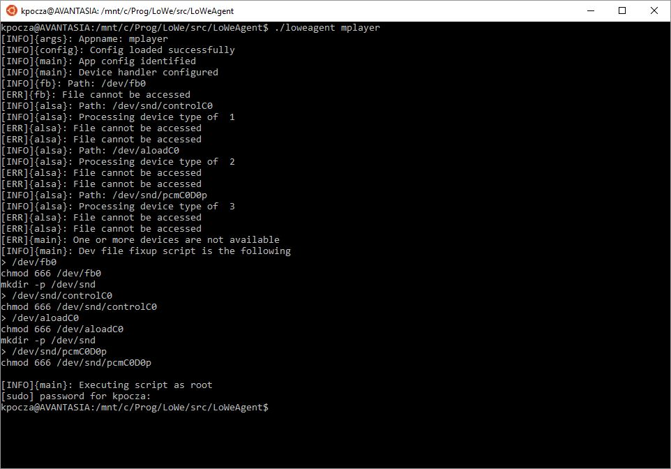
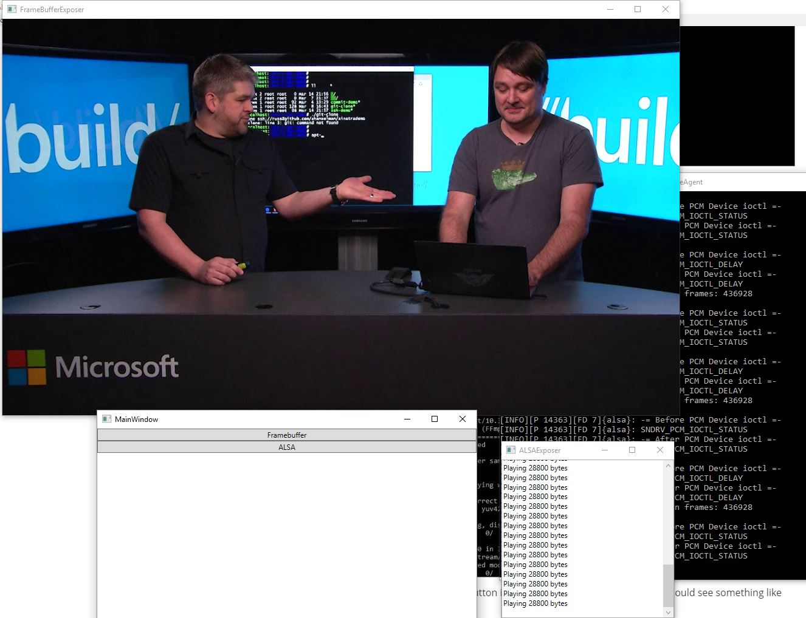
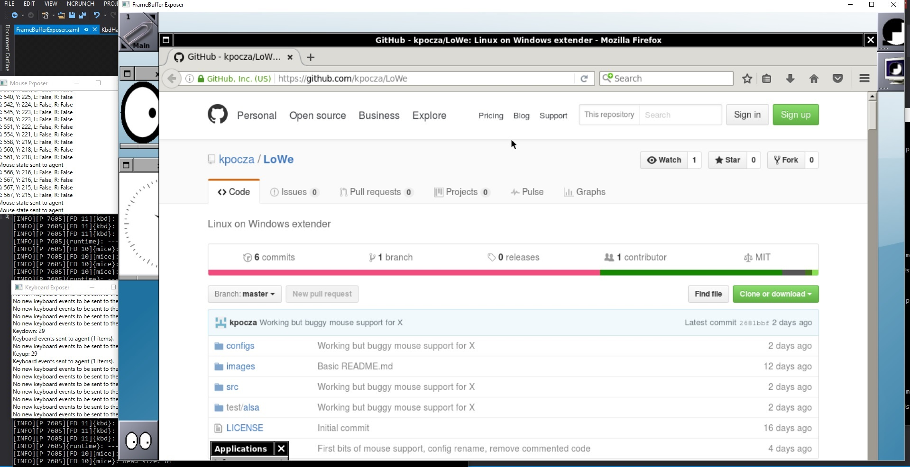

# LoWe
Linux on Windows extender


Bash on Ubuntu on Windows and lxss can really play video and music.


# How it works

The most common way to present graphics and sound on Linux are FrameBuffer (/dev/fb0) and ALSA (/dev/snd/controlC?, /dev/snd/pcmC?D?p, etc.). However lxss doesn't provide these devices at the moment:



LoWe emulates/simulates/tricks these devices while providing the most common functionalities of them. Please be aware that not all device calls are support as of now. The most important goal of this project is to show that lxss is not as closed environment as it seems to be and it can provide more than you expect. On the other hand I just want to learn some Linux system programming even though we are running on top of the Windows kernel.

## Really? How it works?

LoWe creates the missing device files under /dev to let them to be opened by the program and have a file descriptor. Later on it intercepts Linux kernel system calls (syscalls) in user mode via ptrace (like strace). When LoWe thinks that she is responsible to handle given syscalls (ioctl, read, write, mmap, etc.) of particular devices then it provides her own responses to the syscalls instead of going down to the Windows kernel that has no support for those functions.

LoWe consist of two components:

1. loweagent, which runs inside lxss
2. LoWeExposer, which is a Windows application that uses Windows API calls to expose stuff

These apps communicate to each other through the NTFS file system and sockets.

## Exposing Framebuffer

The Framebuffer device (/dev/fb0) provides graphic presentation support on Linux. The device itself supports some basic ioctl calls like querying and setting graphics modes moreover presenting pixel graphics through a memory mapped area.

LoWe creates an empty file that's as huge as the framebuffer size to fit 1280x720x32bpp image without double buffering. Then it tricks the caller to accept this graphics mode for presentation. Applications originally use mmap to map the device memory area. In this case the file content will be memory mapped. A Windows WPF application periodically presents the content of this file (that resides in the temp folder of lxss) in a WPF window.

## Exposing ALSA

ALSA stands for Advanced Linux Sound Architecture that is responsible to provide sound under Linux. It exposes some /devs to provide sounds card control, mixer, MIDI, PCM, etc. functionality. As of now LoWe support basic sound card control functions and the most important PCM (waveform) functions. LoWe providers fake answers to the sound card and PCM setup ioctl call to the program. There is a Windows application that listens on a port (currently 12345) for sound requests. The control and PCM ioctl calls are transferred on the network to this application which uses the Windows sound system through NAudio to play music.

## Exposing TTY, Virtual Console functions

These are in experimental state so that it makes no sense to spend paragraphs on them.

# Starting video playback

If you want to try it yourself, please follow the following steps:

1. You need to start two instances of Bash
   - The first one will run loweagent
   - The second one will run the application
2. You have to start LoWeExposer and click the ALSA button now if you plan to play music



3. loweagent is not a rock solid application yet, so it is prepared to support some predefined applications, like mplayer. Please refer to loweagent.conf.

4. Enter ```./loweagent mplayer``` command to execute LoWeAgent in mplayer mode. It will detect if all devices are available under /dev. Of course not since /dev has the rigid view presented above. Anything new here is bound to the current lxss session (after closing the last bash there will disappear). So LoWe will created them as root:

   

   In the ALSA Exposer window you must see the following:

   ```
   Socket check
   Socket check
   Socket check
   ```

   ​

5. Run the same ```./loweagent mplayer``` command again:


It will start waiting for the mplayer process to start.

6. In the other Bash window start mplayer with some video or audio like 

   ```mplayer my_favourite_video.mkv  ```


7. After clicking the FrameBuffer button in the LoWeExposer application you should see something like this:





# Firefox on Window Maker on X.Org on Bash on Ubuntu on Windows

With LoWe it's possible to run X programs without employing any third-party X servers.

It's ~~a~~~~~~ ~~bit~~ very buggy, but works. Detailed description and reliability improvements come later.



