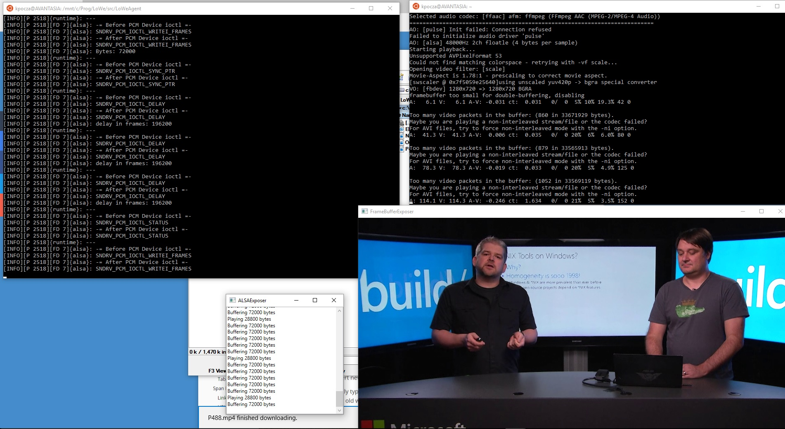
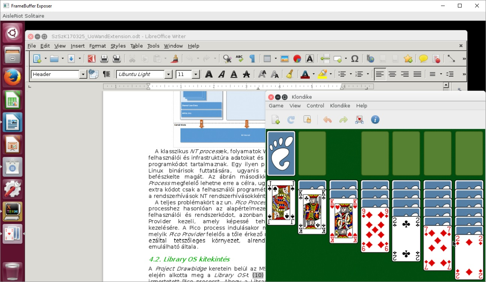
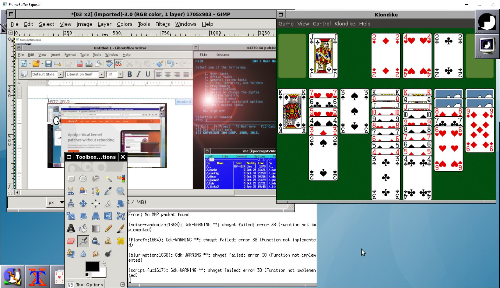

# LoWe
Linux on Windows extender.

Ubuntu on Windows (WSL) released with Windows 10 Anniversary Update runs console based Linux apps on top of the Windows Kernel, not even all of them. The goal of this project is to extend the current functionality of Ubuntu on Windows with support for X apps, video, and sound. Reliability, UX, functionality improvements are expected in the future. **LoWe officially supports Windows 10 Redstone 2 (aka Creators Update) running Ubuntu 16 LTS**. *If you're still running Windows 10 Anniversary Update with Ubuntu 14 LTS then please checkout w10auu14 branch.*

**This branch supports Windows 10 Anniversary Update only with Ubuntu 14 LTS. Windows 10 Creators Update running Ubuntu 16 LTS support is under heavy construction in branch w10rs2u16 which is not fully working yet.**  

Feedback is welcome.

### Bash on Ubuntu on Windows and WSL can really play video and music.

### Graphical apps on Unity on X.Org on Bash on Ubuntu on Windows

With LoWe it's possible to run X programs without employing any third-party X servers.

It's a bit buggy, but works. 

#### Firefox, xterm, xeyes, xclock

#### LibreOffice Writer, Klondike

#### Inkscape, mc, Software

# Details

- [How It Works](docs/howitworks.md)
- [Building LoWe components](docs/buildrun.md)
- [Running mplayer](docs/mplayer.md)
- [Running X programs](docs/x.md)
