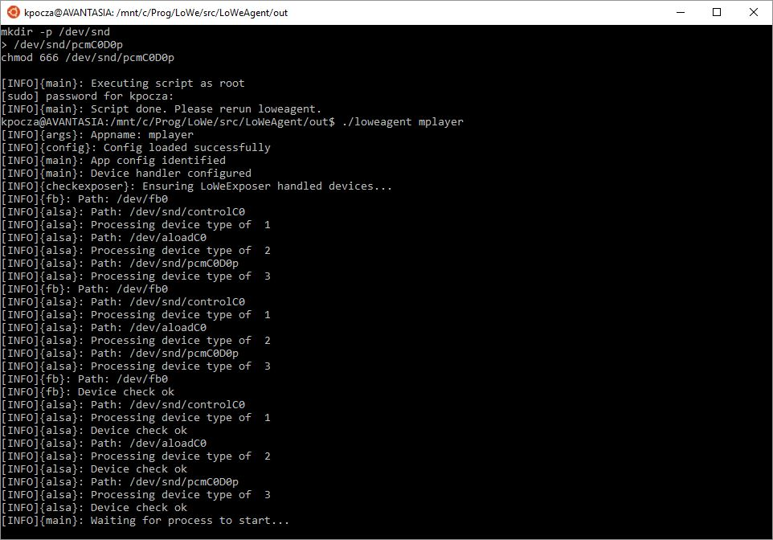
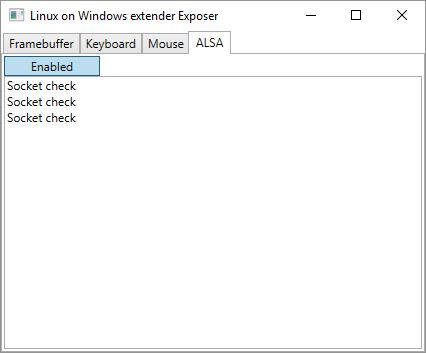
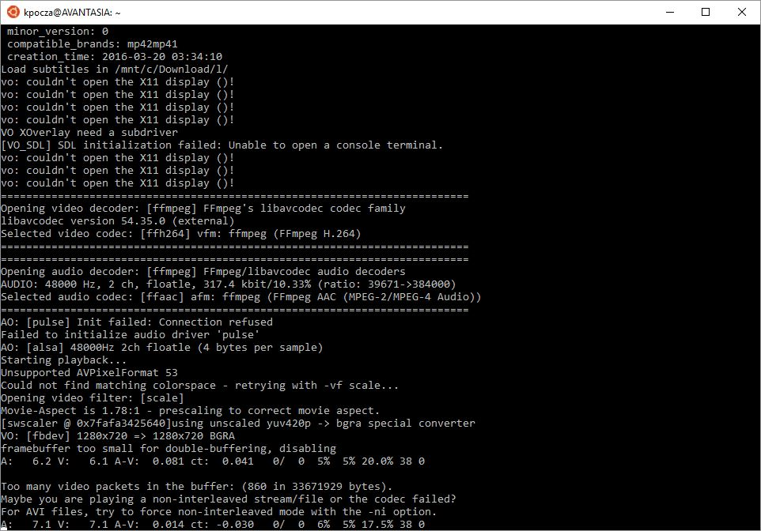

# Video playback via mplayer

Please follow these steps:

1. You need to start two instances of Bash
   - The first one will run loweagent  (cd to the out folder of loweagent)
   - The second one will run the application
2. You have to start LoWeExposer and click the ALSA button now if you plan to play music


3. loweagent is not a generic application yet, so it is prepared to support some predefined applications, like mplayer. Please refer to loweagent.conf.

4. Enter ```./loweagent mplayer``` command to execute LoWeAgent in mplayer mode. It will detect if all devices are available under /dev. Of course not since /dev has only a minimal set of devices. LoWe will created them as root:

   

   (these devices will disappear when the lxss session ends)

5. Run the same ```./loweagent mplayer``` command again:



It will start waiting for the mplayer process to start.

And the ALSA tab of LoWeExposer will show the following messages:



Moreover the Framebuffer Exposer window will popup.

6. In the other Bash window start mplayer with some video or audio like 

```mplayer my_favourite_video.mkv  ```



It can happen that loweagent doesn't catch the mplayer process. In this case mplayer needs to be rerun (sometimes several times). In the future loweagent will have the ability to start the application and don't try to attach to a process that has been just started.

7. Playing video and sound:


