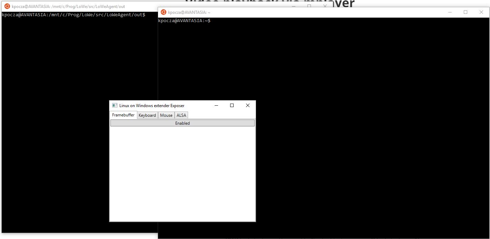
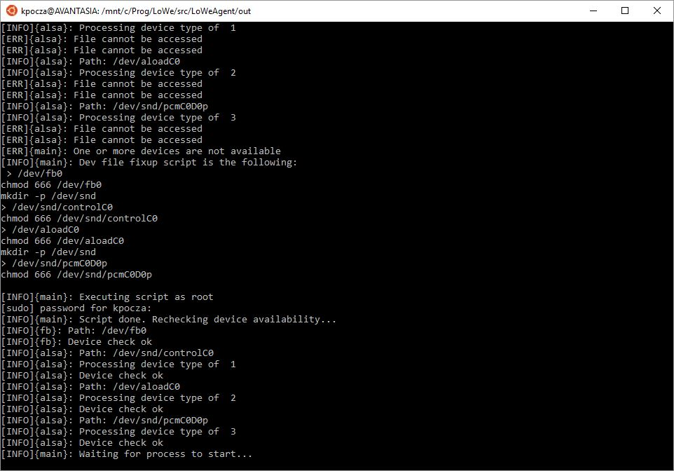
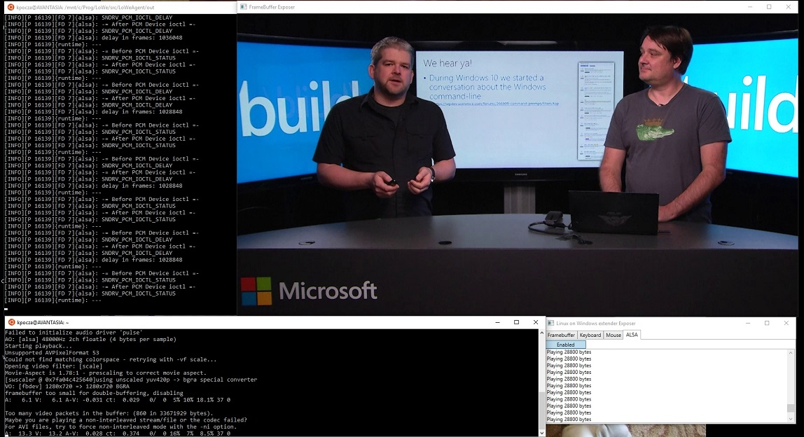

# Video playback via mplayer

It's recommended to first employ the complex way and once you have accustomed to the theory and story behind it then choose the simplified way.

## The complex way

Please follow these steps:

1. You need to start two instances of Bash
   - The first one will run loweagent  (cd to the out folder of loweagent)
   - The second one will run the application
2. You have to start LoWeExposer and click the ALSA button now if you plan to play music



3. loweagent is not a generic application yet, so it is prepared to support some predefined applications, like mplayer. Please refer to loweagent.conf.

4. Enter ```./loweagent mplayer``` command to execute LoWeAgent in mplayer mode (it won't start mplayer itself). It will do the following actions:

   1. Detect if any devices require coordination with LoWeExposer
   2. Check if all regular files that mimic the original /dev file exist
   3. If not then it creates them (as root) and checks for their existence again 

   

   4. It will start waiting for the mplayer process to start
   5. The ALSA tab of LoWeExposer will show the following messages:


​		Moreover the Framebuffer Exposer window will popup.

The devices created by LoWeAgent will disappear when the WSL session ends. They have to be recreated next time.

Next time you may start   ```./loweagent -o mplayer.log mplayer``` to forward log messages to mplayer.log instead of stdout.

5. In the other Bash window start mplayer with some video or audio like 

```mplayer my_favourite_video.mkv  ```


It can happen that loweagent doesn't catch the mplayer process. In this case mplayer needs to be rerun (sometimes several times). In the future loweagent will have the ability to start the application and don't try to attach to a process that has been just started.

6. Playing video and sound:



## The simplified way

The same effect can be achieved by additional parameterization of loweagent that will start the application to be supervised itself. The rules and changes to the complex way are the following:

1. One Bash window is enough

2. LoWeExposer has to be started in the same way as described above

3. Starting ```loweagent -e "mplayer my_favourite_video.mkv -o mplayer.log"``` will start and attach to the mplayer process

   ​