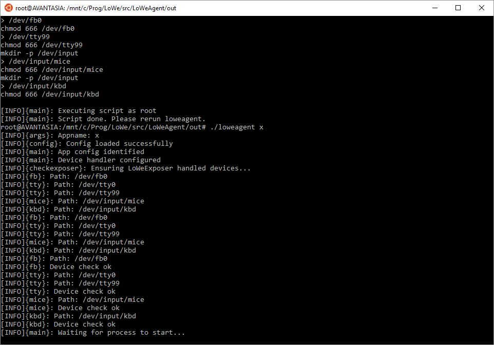
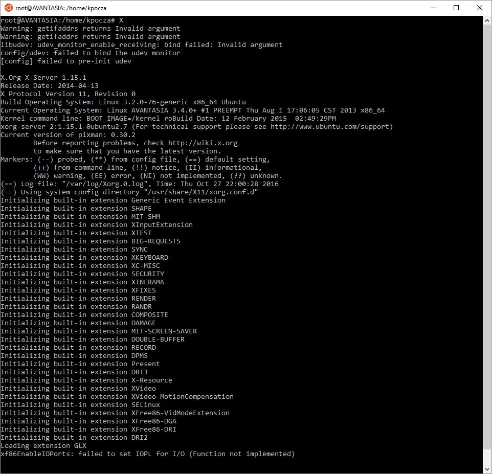
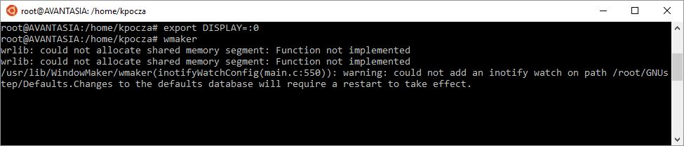
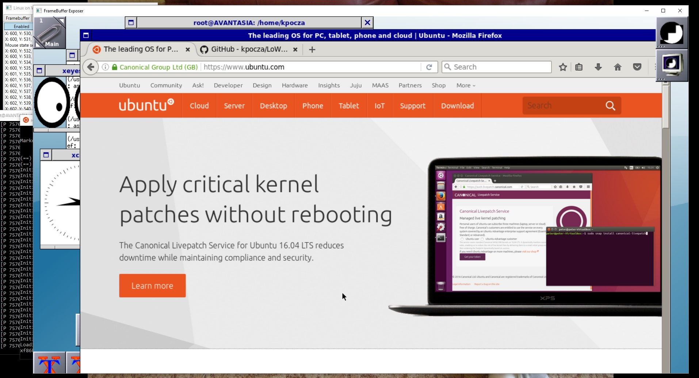

# Running graphical apps on Window Maker on X.Org

Executing X-based graphical apps is a bit circumstantial at the moment. Simplification is expected in the future.

## Prerequisites

The following additional packages are to be installed:

- xserver-xorg
- xserver-xorg-input-kbd
- wmaker

Execute

```
sudo apt install xserver-xorg
sudo apt install xserver-xorg-input-kbd
sudo apt install wmaker
```

Copy the 9-lowe.conf from the configs folder of the local git repository to /usr/share/X11/xorg.conf.d/9-lowe.conf.

The content of the file should look like as follows:


## Steps to follow

1. You need to start three instances of Bash
   - The first one will run loweagent (cd to the out folder of loweagent)
   - The second one will run the X server
   - The third one will run Window Maker the windowing system

   All must switch to root via ```sudo su```.
2. You have to start LoWeExposer, as well


3. loweagent is not a generic application yet, so it is prepared to support some predefined applications, like mplayer or x. Please refer to loweagent.conf.

4. Enter ```./loweagent x``` command in the first Bash to execute LoWeAgent in X mode. It will detect if all devices are available under /dev. Of course not since /dev has only a minimal set of devices. LoWe will created them as root:

   

   ​

5. Run the same ```./loweagent x``` command again:



It will start waiting for the X process to start.

The Keyboard and Mouse tabs of LoWeExposer will confirm that socket check completed and the Framebuffer Exposer window will popup.

6. In the second Bash window start ```X```  or ```xinit```:



It can happen that loweagent doesn't catch the X process. In this case X needs to be rerun (sometimes several times). In the future loweagent will have the ability to start the application and don't try to attach to a process that has been just started.

7. Start Window Maker

   The DISPLAY env var needs to be exported and the wmaker process is to be started:

   ```
   export DISPLAY=:0
   wmaker
   ```

Like this:



8. Run X programs in wmaker

   The actual GUI is presented in the Framebuffer Exposer window. If it has focus, the keyboard input is forwarded to X. To capture (and release) mouse hold the Ctrl+Alt keys and click the left mouse button on top of the mouse cursor presented in the above mentioned window.

