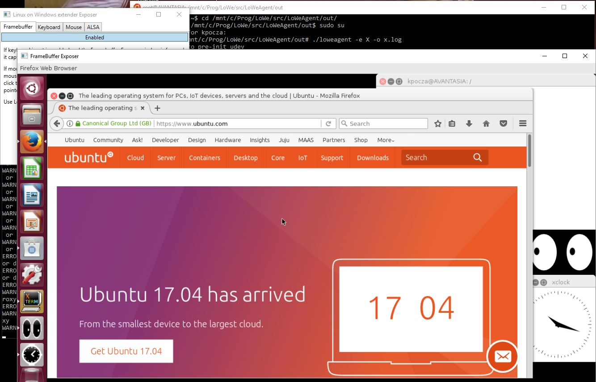
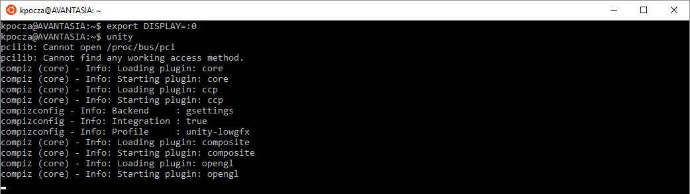

# Running graphical apps on Unity on X.Org (W10 RedStone 2+ - Ubuntu 16 LTS, W10 RedStone 5+ - Ubuntu 18 LTS)

Executing X-based graphical apps is a bit circumstantial at the moment. Simplification is expected in the future.

This documentation contains two ways of starting X. It's recommended to try both simple and complex ways and once you have accustomed to the theory and story behind it then choose the simplified way. The Prerequisites are the same in both cases.

## Prerequisites

The following additional packages are to be installed:

- xserver-xorg
- xserver-xorg-input-evdev
- unity or icewm or fvwm (or wmaker)

1. Execute

```
sudo apt install xserver-xorg
sudo apt install unity
```

2. Copy the 9-lowe.conf from the configs folder of the local git repository to ```/usr/share/X11/xorg.conf.d/9-lowe.conf```.
   The content of the file should look like as follows:

   


   *If you are running Ubuntu 16 LTS please ensure to have UseSIGIO option as seen above, however in case of Ubuntu 18 LTS UseSIGIO should not present.*

3. Install any additional packages, eg. xterm, firefox, libreoffice, etc.

## Steps to follow - Simplified way

Please follow these steps:

1. You need to start two instances of Bash

   - The first one will run loweagent that will start the X server (cd to the out folder of loweagent)
   - The second one will run Unity, the windowing system

2. LoWeExposer has to be started 

   

3. loweagent is not a generic application yet, so it is prepared to support some predefined applications, like mplayer or x. Please refer to loweagent.conf.

4. Enter ```loweagent -e X -o x.log``` command for Ubuntu 16 and ```sudo loweagent -e X -o x.log``` for Ubuntu 18 in the first Bash to execute LoWeAgent that will actually execute X server as well. To be more precise it will do the following actions:

   1. Detect if any devices require coordination with LoWeExposer
   2. Check if all regular files that mimic the original /dev file exist
   3. If not then it creates them (as root - you will be asked for user password to sudo) and checks for their existence again 
   4. It will start the X server

   

   5. The LoWeExposer will show the FrameBuffer window, moreover Keyboard and Mouse check will also take place. 

5. In the second window the ```export DISPLAY=:0``` and ```unity``` commands are to be executed

6. Capture or release the mouse and keyboard input by holding LeftCtrl+LeftAlt and click the mouse inside the Framebuffer Exposer window. Use LeftAlt+F12 to switch the Framebuffer window to fullscreen and back.


## Steps to follow - Complex way

1. You need to start three instances of Bash
   - The first one will run loweagent (cd to the out folder of loweagent)
   - The second one will run the X server
   - The third one will run Unity, the windowing system

2. You have to also start LoWeExposer


3. loweagent is not a generic application yet, so it is prepared to support some predefined applications, like mplayer or x. Please refer to loweagent.conf.

4. Enter ```./loweagent x``` command in the first Bash to execute LoWeAgent in X mode (it won't actually start X). It will do the following actions:

   1. Detect if any devices require coordination with LoWeExposer
   2. Check if all regular files that mimic the original /dev file exist
   3. If not then it creates them (as root - you will be asked for password to sudo) and checks for their existence again 

   

   4. It will start waiting for the X to start

   5. The LoWeExposer will show the FrameBuffer window, moreover Keyboard and Mouse check will also take place. ​


   Next time you may start   ```./loweagent -o x.log x``` to forward log messages to x.log instead of stdout.

5. In the second Bash window start ```X```  or ```xinit```:


It can happen that loweagent doesn't catch the X process. In this case X needs to be rerun (sometimes several times). In the future loweagent will have the ability to start the application and don't try to attach to a process that has been just started.

6. Start Unity in the third Bash

The DISPLAY env var needs to be exported and the unity process is to be started:

```
export DISPLAY=:0
unity
```
Like this:



8. Run X programs in unity

   The actual GUI is presented through the Framebuffer Exposer window. If it has focus, the keyboard input is forwarded to X. To capture (and release) mouse hold the Ctrl+Alt keys and click the left mouse button on top of the mouse cursor presented in the above mentioned window.


9. Capture or release the mouse and keyboard input by holding LeftCtrl+LeftAlt and click the mouse inside the Framebuffer Exposer window. Use LeftAlt+F12 to switch the Framebuffer window to fullscreen and back.
