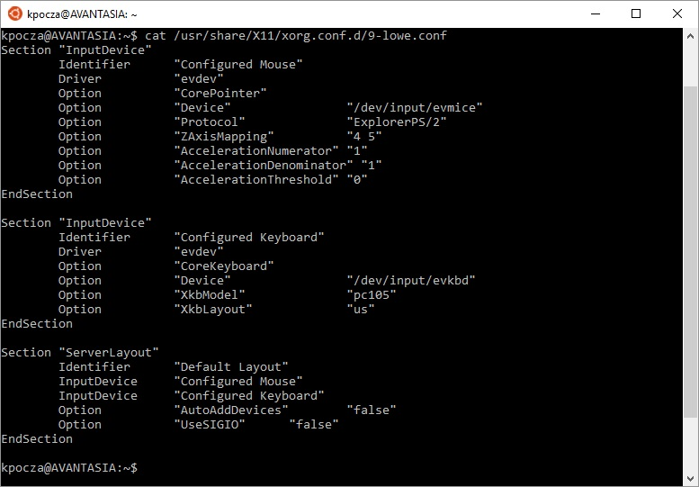
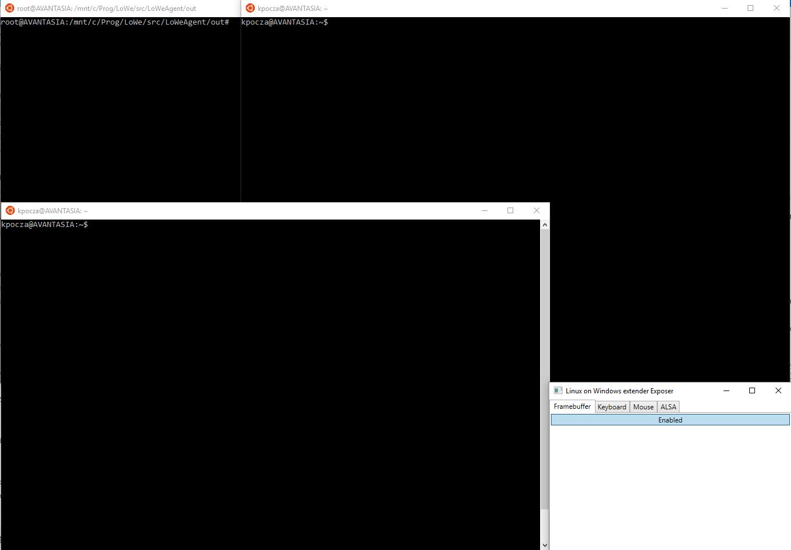
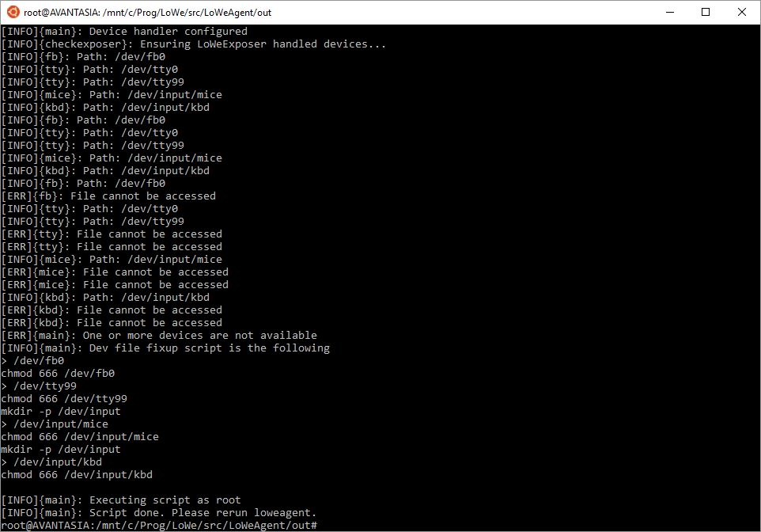
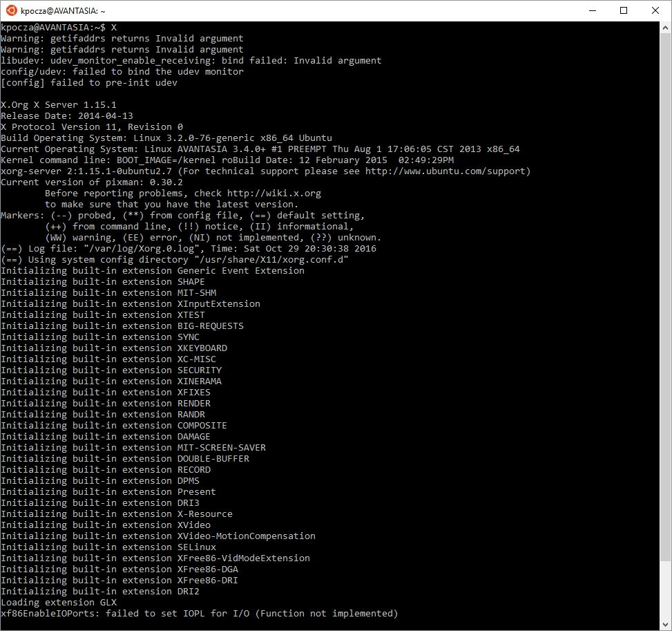
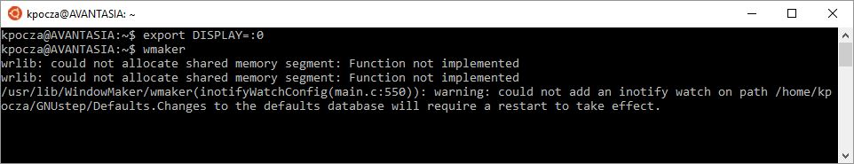

# Running graphical apps on Window Maker on X.Org (W10 RedStone 2 - Ubuntu 16 LTS)

Executing X-based graphical apps is a bit circumstantial at the moment. Simplification is expected in the future.

This documentation contains two ways of starting X. It's recommended to first employ the complex way and once you have accustomed to the theory and story behind it then choose the simplified way. The Prerequisites are the same in both cases.

## Prerequisites

The following additional packages are to be installed:

- xserver-xorg
- xserver-xorg-input-evdev
- wmaker

Execute

```
sudo apt install xserver-xorg
sudo apt install wmaker
```

Copy the 9-lowe.conf from the configs folder of the local git repository to ```/usr/share/X11/xorg.conf.d/9-lowe.conf```.

The content of the file should look like as follows:



Install any additional packages, eg. xterm, firefox, libreoffice, etc.

## Steps to follow - Complex way

1. You need to start three instances of Bash
   - The first one will run loweagent (cd to the out folder of loweagent)
   - The second one will run the X server
   - The third one will run Window Maker the windowing system

   The **first one** must **switch to root** via ```sudo su```. The reason is that X is a setuid root program so that the tracer should run as root, as well.
2. You have to also start LoWeExposer



3. loweagent is not a generic application yet, so it is prepared to support some predefined applications, like mplayer or x. Please refer to loweagent.conf.

4. Enter ```./loweagent x``` command in the first Bash to execute LoWeAgent in X mode (it won't actually start X). It will do the following actions:

   1. Detect if any devices require coordination with LoWeExposer
   2. Check if all regular files that mimic the original /dev file exist
   3. If not then it creates them (as root) and checks for their existence again 

   

   4. It will start waiting for the X to start

   5. The LoWeExposer will show the FrameBuffer window, moreover Keyboard and Mouse check will also take place. 

      ​

   Next time you may start   ```./loweagent -o x.log x``` to forward log messages to x.log instead of stdout.

5. In the second Bash window start ```X```  or ```xinit```:



It can happen that loweagent doesn't catch the X process. In this case X needs to be rerun (sometimes several times). In the future loweagent will have the ability to start the application and don't try to attach to a process that has been just started.

6. Start Window Maker in the third Bash

The DISPLAY env var needs to be exported and the wmaker process is to be started:

```
export DISPLAY=:0
wmaker
```
Like this:



8. Run X programs in wmaker

   The actual GUI is presented through the Framebuffer Exposer window. If it has focus, the keyboard input is forwarded to X. To capture (and release) mouse hold the Ctrl+Alt keys and click the left mouse button on top of the mouse cursor presented in the above mentioned window.


## Steps to follow - Simplified way

The same effect can be achieved by additional parameterization loweagent that will start the application to be supervised itself. The rules and changes to the complex way are the following:

1. Two Bash windows are enough
2. LoWeExposer has to be started in the same way as described above
3. Starting ```sudo loweagent -e "X -o x.log"``` will start and attach to the X process
4. In the second window the ```export DISPLAY=:0``` and ```wmaker``` commands are to be executed